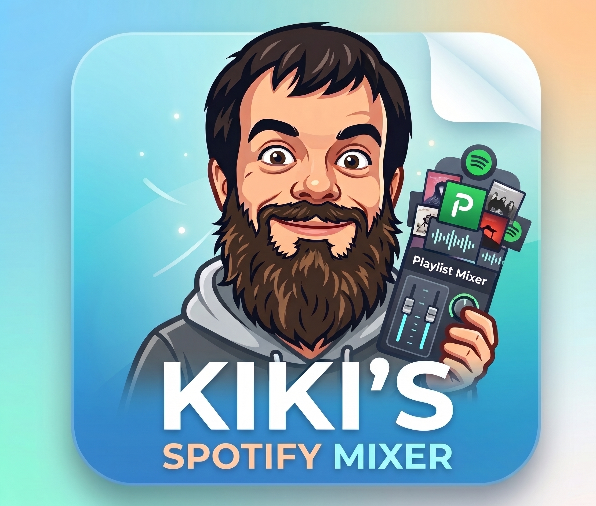

#  Kiki's Spotify Mixer for Mac

> **🤖 Built with AI**: Conceived and designed by **Quio**, coded and assembled using AI with **Google Antigravity**.

A lightweight, powerful Spotify controller and library manager tailored for **macOS**. It provides **true mathematical random shuffle (Fisher-Yates)**, a **multi-label tagging system with boolean filtering and bulk management**, **drag-and-drop reordering with auto-scroll**, a **live contextual tracklist view**, and **offline AppleScript local control**.

---

## 🌟 Key Features

### 1. 🔀 True Mathematical Random Shuffle
* **Cryptographic Uniform Permutation**: Unlike Spotify's default algorithm (which biases towards popular tracks or repeats recent artists), this app executes a pure Fisher-Yates shuffle.
* **Anti-Clumping (Optional)**: Intelligently spaces out consecutive songs from the same artist.
* **Direct Spotify Sync**: Automatically disarms Spotify's internal shuffle so your exact randomized sequence plays cleanly in order.

### 2. 🏷️ Multi-Label Tagging & Bulk Management
* **Custom Tags**: Create tags with custom color badges (e.g. `#Focus`, `#Workout`, `#Acoustic`, `#90s`, `#LateNight`).
* **Desktop Selection**:
  * Single-click any song row to select.
  * `Cmd + Click` for non-contiguous multi-selection.
  * `Shift + Click` for range selection.
  * `Cmd + A` to select all songs.
* **Drag-to-Tag**: Drag songs directly onto any `#Tag` badge in the sidebar to label them in bulk.
* **Quick Untagged Filter**: Single-click "⭐ Untagged Songs" in the sidebar to organize your unprocessed library.

### 3. 🔍 Boolean Logic Filters
* Combine tags seamlessly:
  * **`AND (All)`**: e.g., `#Workout` AND `#Rock` (tracks matching both).
  * **`OR (Any)`**: e.g., `#Focus` OR `#Chill` (tracks matching either).
  * **`NOT (Exclude)`**: e.g., `#Rock` NOT `#Slow`.

### 4. ↕️ Drag & Drop Reordering & User Custom Order
* **Persistent Sequence**: Keep your personalized playlist arrangements.
* **Dynamic Auto-Scroll**: Dragging songs near top/bottom boundaries automatically scrolls the view with smooth acceleration.
* **Safety & Undo**: Full `Cmd + Z` undo support for reordering.

### 5. 👁️ Live Context Queue ("Now Playing" Follower)
* Live right-hand side panel showing the active track with animated visualizer, past history (dimmed), and upcoming queued tracks.
* Automatically smooth-scrolls to keep the playing track centered.

### 6. 📴 Offline Support (macOS AppleScript Bridge)
* If internet connection drops or offline mode is needed, the backend automatically communicates directly with `Spotify.app` on macOS via local AppleScript IPC to control playback with zero network latency.

---

## ⌨️ Desktop Keyboard Shortcuts

| Shortcut | Action |
| :--- | :--- |
| `Space` | Play / Pause |
| `Cmd + →` / `Cmd + ←` | Next / Previous Track |
| `↑` / `↓` | Move selection |
| `Shift + ↑` / `Shift + ↓` | Expand selection range |
| `Cmd + Click` | Toggle individual song selection |
| `Shift + Click` | Range selection |
| `Cmd + A` | Select all visible songs |
| `Escape` | Clear selection / Close modals |
| `T` | Open Tag modal for selected songs |
| `Cmd + Z` | Undo last drag reorder |
| `/` | Focus search bar |

---

## 🚀 Quick Start on macOS

### Prerequisites
* macOS 12+ (Monterey or later)
* Python 3.10+
* Spotify Desktop App & a Spotify account

### Installation & Run

1. **Clone the repository:**
   ```bash
   git clone https://github.com/<YOUR_GITHUB_USERNAME>/Kikis_spotify_mixer_for_mac.git
   cd Kikis_spotify_mixer_for_mac
   ```

2. **Start the application:**
   ```bash
   ./run.sh
   ```
   *(The script will automatically create a virtual environment, install requirements, and launch the server).*

3. **Open the App:**
   Open your browser to [http://localhost:8888](http://localhost:8888).

---

## ⚙️ 1-Minute Spotify API Setup

1. Open [developer.spotify.com/dashboard](https://developer.spotify.com/dashboard) and log in.
2. Click **Create App**:
   * **App Name**: `Kikis Spotify Mixer`
   * **Redirect URI**: `http://127.0.0.1:8888/callback`
   * **APIs Used**: Select `Web API`
3. In Kiki's Spotify Mixer, click the **⚙️ Settings** icon in the top right.
4. Paste your **Client ID** and **Client Secret**, then click **Save & Connect Spotify**.

---

## 🛠️ Architecture

* **Backend**: FastAPI / Python, SQLite for custom tag indexing, Spotipy for Spotify Web API integration, macOS AppleScript bridge for native desktop control.
* **Frontend**: Pure modern Vanilla JavaScript, CSS3, responsive UI with zero heavy frontend framework bloat.
